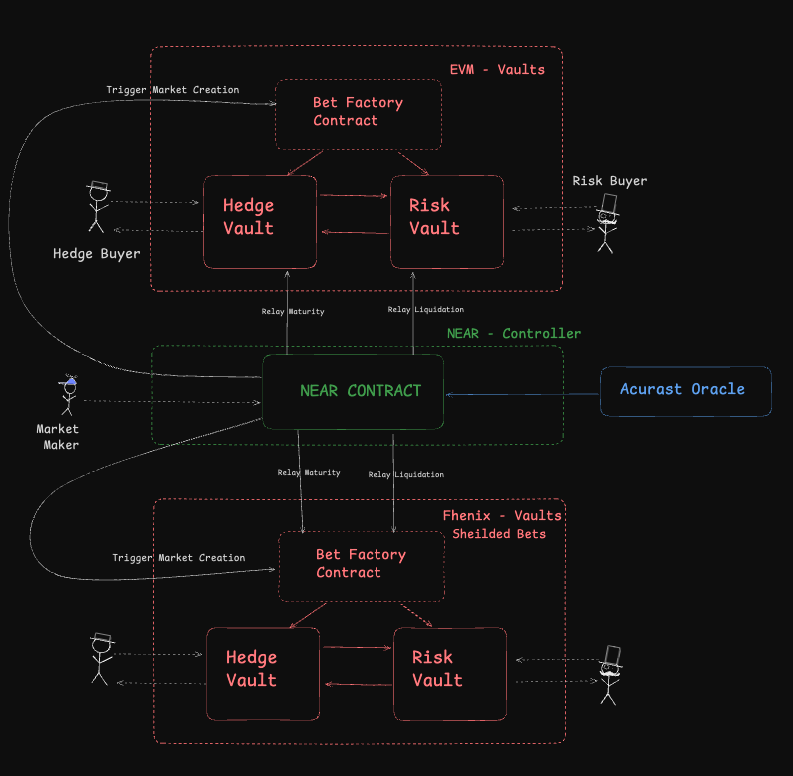

# Overview

Note: The starting point of the repo is the fork for Near example on how to interact with EVM chain from Near Protocol. https://github.com/near-examples/chainsig-script

The Near contract is here, along with some tests
https://github.com/enderNakamoto/omnibets/blob/main/near_contracts/src/lib.rs

**Other Repos of the project: **

#### Two Favors of EVM Vaults controlled by Near Smart contract: 

* EVM Vault Protocol: https://github.com/* enderNakamoto/omnibets_vault
* EVM Encrypted Vault Protocol: https://github.com/enderNakamoto/omnibets_vault_fhenix

## What is OmniBets

It is a decentralized Betting and Hedging System

This system is designed to create a decentralized betting and hedging environment that spans across different EVM-compatible chains, including standard EVM chains and specialized chains like Fhenix. The architecture leverages a **NEAR contract** to control vaults on multiple EVM chains, enabling unified control and coordination over various types of vaults, each with unique properties.

## Components

### 1. Bet Factory Contract
- Deployed on an EVM-compatible chain, the Bet Factory Contract initiates new bets by generating pairs of vaults:
  - **Hedge Vault**
  - **Risk Vault**
- These vaults are **ERC4626-compliant** smart contracts, following a standard for tokenized yield-bearing vaults, allowing users to deposit, withdraw, and earn returns on assets in a standardized manner.
- Each time a new bet is created, two “sister” vaults (Hedge and Risk) are generated with a unique bet ID.

### 2. Vault Types
The system has two primary flavors of vaults, each designed to support different types of privacy and operational requirements.

#### Plain EVM Vaults
- These are standard vaults deployed on typical EVM-compatible chains (like Ethereum, Polygon, etc.).
- **Transparency**: The states of these vaults are visible on the blockchain, meaning all participants can see the assets held within and the interactions occurring between the Hedge and Risk vaults.
- **Liquidation and Maturity Process**:
  - **Liquidation**: If a specified condition (triggered by external data or oracle feeds) is met, all assets from the Risk Vault are moved to the Hedge Vault, protecting the assets of hedge participants.
  - **Maturity without Liquidation**: If the bet reaches maturity without liquidation, the assets in the Hedge Vault move to the Risk Vault, rewarding the risk-takers.

#### Fhenix Vaults (FHE-based EVM)
- These vaults are deployed on **Fhenix**, an EVM-compatible chain that supports **Fully Homomorphic Encryption (FHE)**, allowing encrypted data to be processed without revealing its contents.
- **Privacy-Preserving Bets**: In this setup, bets and asset states within the vaults can remain private, meaning that participants and external observers cannot see the specific values or interactions within the vault. Only the final outcomes, such as liquidation or maturity events, are visible.
- **Encrypted Computation**: Using FHE, all operations on the vaults are computed in an encrypted form, ensuring privacy for sensitive bets where users may prefer to keep their positions or strategies hidden from others on the blockchain.
- **Examples**: A user may place a private bet on sensitive data (such as personal or restricted information) without exposing it on-chain, relying on the NEAR contract to enforce the outcome based on encrypted computations.

### 3. NEAR Contract (Controller)
- The NEAR contract acts as a **centralized controller** for all vaults across multiple EVM-compatible chains, including both the Plain EVM and Fhenix environments.
- **Cross-Chain Control with Chain Signatures**: Using cryptographic chain signatures, the NEAR contract can control accounts and manage vaults on any EVM-compatible chain, allowing it to trigger events, process liquidations, and oversee maturities across diverse environments.
- **Unified Control for Different Flavors of Vaults**: The NEAR contract’s ability to manage multiple types of vaults enables a single-point control for different flavors (e.g., standard EVM vaults for transparent bets and Fhenix vaults for privacy-focused bets). This flexibility supports various user preferences and regulatory requirements.
- **Scalability**: With this cross-chain capability, the NEAR contract can be extended to manage vaults on additional EVM-compatible chains in the future, facilitating the addition of new types of betting platforms or vault protocols under the same control structure.

### 4. Acurast Oracle
- The **Acurast Oracle** supplies off-chain data required to trigger specific bet conditions. This data is crucial for the liquidation and maturity mechanisms, as it provides the external information necessary to evaluate bet outcomes.
- **Trusted Execution Environment (TEE)**: The Acurast Oracle uses Node.js scripts running within a TEE to securely fetch and relay data from external APIs (like weather or financial data) to the NEAR contract.

Basically, using Acurast we can call any API and forward the reuslt to smart contractw without  too much trust overhear 

Note: You can find out more on Acurast's trust minimized processing here - https://docs.acurast.com/acurast-protocol/architecture/end-to-end/

## Conclusion:
Overall, This architecture enables scalability, privacy, and adaptability, supporting multiple betting(prediction market) protocols while providing users with options for data transparency and protection.

